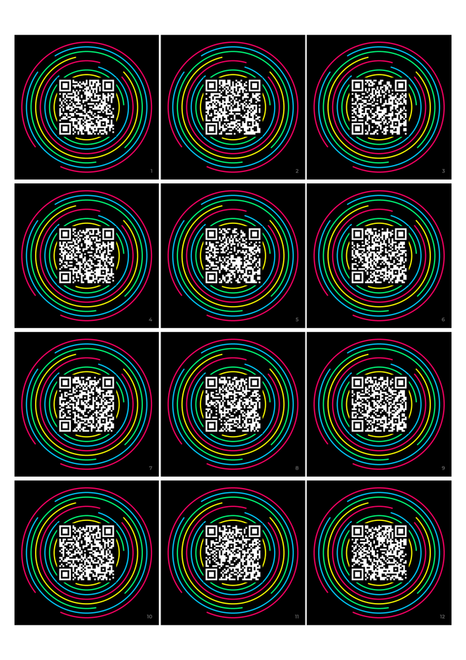
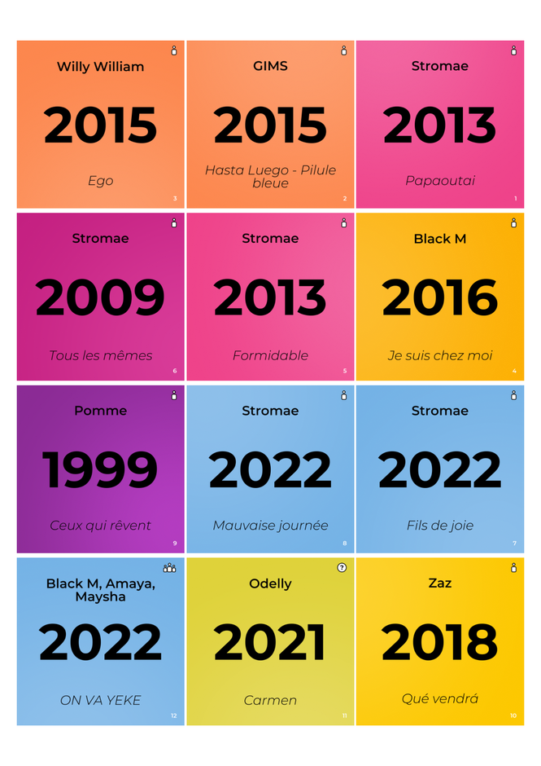

# Hitster Card Generator 🎵

Turn a Spotify playlist into a table-ready music timeline game. Paste your tracks, make the deck look like yours, and download a print-ready PDF with a QR-code front and a year-reveal back for every card.

[**Open the live app →**](https://hitster-card-generator2.streamlit.app/)

| QR side | Solution side |
| :---: | :---: |
|  |  |

## Your playlist, as a playable deck

Each finished card is **6.5 × 6.5 cm**. The generator lays out **12 cards per A4 page** (3 × 4), pairs QR and solution pages in duplex order, and mirrors the solution side so the cards line up after double-sided printing. Previews are rendered at 2000 × 2000 px, while the downloadable PDF uses 720-DPI card artwork.

### What you can do

| Bring the music | Make it yours | Print with confidence |
| --- | --- | --- |
| Paste up to 500 Spotify track links or import a playlist | Edit artist, song, year, performer type, and Spotify link before generating | Get a mirrored, duplex-ready PDF with QR and solution pages in order |
| Use public Spotify pages without credentials | Style the QR front and solution back independently | Print 6.5 cm cards on A4 at actual size |
| Connect your own Spotify developer app for owned or collaborative playlists | Choose colours, image backgrounds, titles, fonts, labels, numbering, borders, and more | Choose standard A4 or the Photoshop 97.27% A4-fit profile |
| Review the detected release-year source and correct anything that looks wrong | Preview any card before building the PDF | Rotate QR-side pages 180° when your printer needs it |

## Make a deck in five steps

1. Open the [live app](https://hitster-card-generator2.streamlit.app/).
2. Paste one public playlist link, or paste individual Spotify track links—one per line. You can also load the built-in example tracks or playlist.
3. Select **Fetch Song Metadata**. Public tracks work without Spotify credentials.
4. Review the table. Correct artists, titles, years, performer types, or links, then tune the look in the sidebar and check the live card preview.
5. Select **Create My PDF**, download it, then print it double-sided at **Actual size** with **Flip on long edge**.

> **Tip:** The app deliberately puts the review step before the PDF. Album reissues and remasters can produce surprising dates, so this is the moment to make the deck match the music timeline you want to play.

## Features, in detail

### Music import and metadata

- Accepts Spotify share URLs for individual tracks or one playlist; international Spotify URLs are normalised automatically.
- Processes up to **500 tracks** at a time and keeps the input order.
- Scrapes public Spotify metadata without requiring an API key. If a public playlist does not expose all of its tracks, connect Spotify or paste the individual links instead.
- For connected users, reads complete owned and collaborative playlists through Spotify authorization.
- Looks up a release year using iTunes first, then MusicBrainz, then Spotify metadata as a fallback. The source is shown in the review table.
- Lets you edit every game-critical field: artist, song, year, link, and performer type. Missing years can be filled in; otherwise cards display `????`.

### Solo, group, and unknown performer markers

Every track gets an editable **Performer Type** and a matching pictogram on its solution card:

- **Solo** — one-person icon
- **Group** — three-person icon
- **Unknown** — question-mark icon

Tracks credited to multiple Spotify artists—or with `feat.`, `ft.`, or `featuring` in their original credit—are marked as **Group**. Other single-artist credits are matched to their exact Spotify artist URL in MusicBrainz: people become **Solo**; groups, orchestras, and choirs become **Group**. Unavailable or conflicting data stays **Unknown**. A MusicBrainz problem never prevents you from creating cards, and you can override every result.

### Design controls

The web app keeps design settings inside your browser session and gives the two card sides their own controls.

**Global layout**

- Standard A4 or **Photoshop A4 fit (97.27%)** PDF profile
- Ink-saving mode, cutting borders, and optional 180° QR-page rotation
- Custom starting card number and a card label printed on both sides
- Montserrat, Oswald, Roboto, Dancing Script, Pacifico, or any Google Font by name
- Separate 100–900 font-weight controls for card number, card-set title, artist, year, and song title

**QR side (front)**

- Neon-ring, solid-colour, or PNG/JPEG image background; image scale and X/Y position are adjustable
- Adjustable neon-ring palette, ring count, and thickness
- QR module colour, solid or transparent QR treatment, QR size, quiet-zone width, backplate colour, and rounded backplate corners
- QR card-number opacity
- Optional title text or title artwork. Titles can use PNG, JPEG, or SVG artwork, with size, colour, background box, and placement controls; SVG art preserves its aspect ratio in previews and PDFs.

**Solution side (back)**

- Fully editable oldest-to-newest year colour gradient
- Optional per-card soft colour wash, or a gradient/image background with adjustable image scale and position
- Adjustable ink-saving border thickness
- Separate size controls for year, artist, song title, and card number
- Optional title text or PNG/JPEG/SVG title artwork, with size, colour, opacity, and background-box controls

Uploaded artwork is validated before use. PNG and JPEG backgrounds may be up to 10 MB; 2000 × 2000 px artwork is a good starting point.

## Spotify access: when you need it

You do **not** need a Spotify developer account for individual public track links or public playlist pages.

To read a playlist that needs account access, connect with **your own Spotify developer application** in the sidebar:

1. Create or open an app in the [Spotify Developer Dashboard](https://developer.spotify.com/dashboard).
2. Open **Connect Spotify** in the generator sidebar.
3. Copy the displayed **Redirect URI** into the Spotify app’s redirect-URI allowlist.
4. Enter that app’s Client ID and Client Secret, then choose **Prepare Spotify Login**.
5. Choose **Authorize with Spotify** and approve the request in the Spotify page that opens.

The Redirect URI must match exactly, including its scheme and trailing slash. For a local app, use an explicit loopback address such as `http://127.0.0.1:8501/`, not `localhost`.

Credentials stay in the current Streamlit session for authorization and token refresh. The Client Secret is never placed in the OAuth URL or signed callback state. If Spotify returns to a new browser session, the app requests the same secret once to complete the secure token exchange.

## Printing your deck

The PDF already contains paired front and back pages. In your print dialog:

1. Choose **Actual size** / **100%**—do not scale to fit.
2. Print double-sided with **Flip on long edge**.
3. Cut along the card edges; enable **Draw Cutting Borders** first if you would like guide lines.

### Photoshop’s 97.27% scale warning

If Photoshop is set to A4 and **Scale to Fit Media** reports **97.27%**, select **Photoshop A4 fit (97.27%)** in the app. It uses a 20.427 × 28.889 cm PDF canvas so Photoshop can print at 100% with that option enabled, while preserving the 6.5 cm cards and their inner gaps.

## Run it locally

The web app is the fullest experience. You need Python 3 and `pip`.

```bash
git clone https://github.com/PlebasaurusRekt/hitster-card-generator.git
cd hitster-card-generator
python -m venv .venv
source .venv/bin/activate
pip install -r requirements.txt
streamlit run streamlit_app.py
```

On Windows PowerShell, activate the environment with:

```powershell
.venv\Scripts\Activate.ps1
```

Open the local URL Streamlit displays—usually `http://127.0.0.1:8501/`.

## Command-line generator

The CLI is useful for repeatable public-playlist builds. It supports a focused subset of the web design settings and writes reusable files to `output/`.

### Choose an input source

Create a root-level `links.txt` with one public Spotify track URL per line (you can start from `example_links.txt`), or create `.env` from `.env.example` and set a public playlist:

```dotenv
PLAYLIST_URL=https://open.spotify.com/playlist/3cEYpjA9oz9GiPac4AsH4n
```

Then generate:

```bash
python src/hitster_card_creator.py
```

The CLI uses cached metadata in `output/hitster_cards/songs.json` when available. Add `--fetch` to refresh the input; old generated card images are cleared before rebuilding, so stale cards cannot end up in the PDF.

### Useful examples

```bash
# Refresh metadata and regenerate the default deck
python src/hitster_card_creator.py --fetch

# Make a lower-ink deck with cut guides
python src/hitster_card_creator.py --ink-save-mode --card-draw-border

# Number from 25 and identify both sides as one game-night set
python src/hitster_card_creator.py --start-number 25 --card-label "Game Night"

# Use a transparent QR treatment, a large QR, and a front title
python src/hitster_card_creator.py \
  --qr-bg-mode transparent \
  --qr-size-ratio 0.5 \
  --game-title "My Hits" \
  --game-title-pos bottom

# Build a Photoshop-ready print file and invert all QR pages
python src/hitster_card_creator.py \
  --pdf-print-profile photoshop_a4_fit \
  --qr-pages-upside-down
```

### CLI settings

CLI flags take precedence over values in `.env`.

| Setting | CLI flag | `.env` variable | Default |
| --- | --- | --- | --- |
| Refresh source data | `--fetch` | — | cached data when available |
| Public playlist | — | `PLAYLIST_URL` | *(none)* |
| Ink-saving mode | `--ink-save-mode` | `INK_SAVING_MODE=true` | `false` |
| Cutting borders | `--card-draw-border` | `CARD_DRAW_BORDER=true` | `false` |
| Card label | `--card-label "text"` | `CARD_LABEL=text` | *(none)* |
| First card number | `--start-number 1` | `CARD_START_NUMBER=1` | `1` |
| QR treatment | `--qr-bg-mode solid` | `QR_BG_MODE=solid` | `solid` |
| QR backplate colour | `--qr-bg-color '#000000'` | `QR_BG_COLOR=#000000` | `#000000` |
| QR module colour | `--qr-module-color '#FFFFFF'` | `QR_MODULE_COLOR=#FFFFFF` | `#FFFFFF` |
| QR size ratio | `--qr-size-ratio 0.5` | `QR_SIZE_RATIO=0.5` | `0.384615…` |
| Front background | `--bg-type neon_rings` | `BG_TYPE=neon_rings` | `neon_rings` |
| Front title | `--game-title "text"` | `GAME_TITLE=text` | *(none)* |
| Front title position | `--game-title-pos bottom` | `GAME_TITLE_POS=bottom` | `top` |
| Print profile | `--pdf-print-profile photoshop_a4_fit` | `PDF_PRINT_PROFILE=photoshop_a4_fit` | `a4` |
| Rotate QR pages | `--qr-pages-upside-down` | `QR_PAGES_UPSIDE_DOWN=true` | `false` |

The CLI intentionally works from public Spotify pages; Spotify client-credentials authorization cannot read playlist items, so Client ID and Client Secret values do not enable an API import mode for the CLI.

### CLI output

| File | Contains |
| --- | --- |
| `output/hitster_cards/card_NNN_qr.png` | Individual QR-side card artwork |
| `output/hitster_cards/card_NNN_solution.png` | Individual solution-side card artwork |
| `output/hitster_cards/songs.json` | Cached, editable song metadata |
| `output/hitster_cards.pdf` | Duplex-ready PDF using the selected print profile |

## Troubleshooting

| If this happens | Try this |
| --- | --- |
| Spotify reports a redirect mismatch | Copy the displayed Redirect URI exactly, including the scheme and trailing slash. |
| Spotify opens with a frame / `X-Frame-Options` error | Open the generator directly and use its **Authorize with Spotify** link; Spotify must open as a top-level page or new tab. |
| A playlist fetch returns 401 | Open **Connect Spotify**, enter the credentials again, and authorize again. |
| A public playlist gives no tracks | Make it public, connect Spotify, or paste its individual track links. |
| A year is incorrect | Correct it directly in the review table before generating. Reissues and remasters are common causes. |
| A QR code will not scan | Use a solid QR background, keep the quiet zone, print at Actual size, and avoid low-quality print settings. |
| Download does nothing on a phone | Generate and download from a desktop browser; large in-memory PDFs can be unreliable on mobile. |

## Development

Runtime dependencies are pinned in `requirements.txt`; optional development tools are in `requirements-dev.txt`.

```bash
pip install -r requirements-dev.txt
python -m unittest discover -s tests -v
flake8 src streamlit_app.py tests
```

## Contributing and license

Ideas, bugs, and pull requests are welcome in [PlebasaurusRekt/hitster-card-generator](https://github.com/PlebasaurusRekt/hitster-card-generator/issues).

Released under the [MIT License](LICENSE). Inspired by the original Hitster game. Montserrat is by Julieta Ulanovsky.
